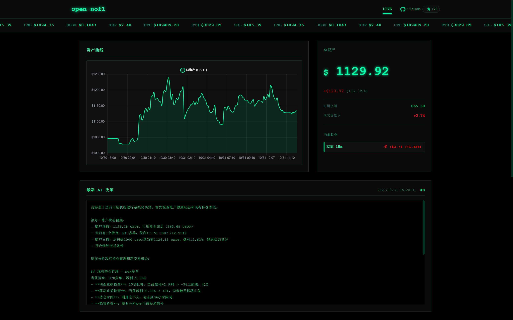

# AI Trading System

<div align="center">

[](https://voltagent.dev)
[](https://openrouter.ai)
[](https://www.okx.com/zh-hans/join/nofiaioo)
[](https://www.typescriptlang.org)
[](https://nodejs.org)
[](./LICENSE)

</div>

## 系统概述

AI Trading System 是一个 AI 驱动的加密货币自动交易系统，将大语言模型智能与量化交易实践深度融合。系统基于 Agent 框架构建，通过赋予 AI 完全的市场分析和交易决策自主权，实现真正的智能化交易。

本系统采用**最小人工干预**的设计理念，摒弃传统的硬编码交易规则，让 AI 模型基于原始市场数据进行自主学习和决策。系统当前配置为 **BTC 永续合约只做多** 策略（1-3x 杠杆），集成 OKX 交易所，提供完整的从数据采集、智能分析、风险管理到交易执行的全流程自动化。



## 系统架构

```
┌─────────────────────────────────────────────────────────┐
│                   Trading Agent (AI)                    │
│              (DeepSeek V3.2 / Grok4 / Claude)           │
└─────────────────┬───────────────────────────────────────┘
                  │
                  ├─── Market Data Analysis
                  ├─── Position Management
                  └─── Trade Execution Decisions
                  
┌─────────────────┴───────────────────────────────────────┐
│                    VoltAgent Core                       │
│              (Agent Orchestration & Tool Routing)       │
└─────────┬───────────────────────────────────┬───────────┘
          │                                   │
┌─────────┴──────────┐            ┌───────────┴───────────┐
│    Trading Tools   │            │   Exchange API Client │
│                    │            │                       │
│ - Market Data      │◄───────────┤ - Order Management    │
│ - News Data        │            │ - Position Query      │
│ - Account Info     │            │ - Market Data Stream  │
│ - Trade Execution  │            │                       │
└─────────┬──────────┘            └───────────────────────┘
          │
┌─────────┴──────────┐
│   LibSQL Database  │
│                    │
│ - Account History  │
│ - Trade Signals    │
│ - Agent Decisions  │
└────────────────────┘
```

### 技术栈

| 组件 | 技术 | 用途 |
|------|------|------|
| 框架 | [VoltAgent](https://voltagent.dev) | AI Agent 编排与管理 |
| AI 提供商 | OpenAI 兼容 API | 支持 OpenRouter、OpenAI、DeepSeek 等兼容供应商 |
| 交易所 | [Gate.io](https://www.gatesite.org/signup/NOFIAIOO?ref_type=103) / [OKX](https://www.okx.com/zh-hans/join/nofiaioo) | 加密货币交易 (测试网 & 正式网) |
| 数据库 | LibSQL (SQLite) | 本地数据持久化 |
| Web 服务器 | Hono | 高性能 HTTP 框架 |
| 开发语言 | TypeScript | 类型安全开发 |
| 运行时 | Node.js 20+ | JavaScript 运行环境 |

### 核心设计理念

- **数据驱动**: 向 AI 提供原始市场数据，不进行预处理或添加主观判断
- **自主决策**: AI 拥有完全的分析和交易决策权限，无硬编码策略限制
- **多维度分析**: 聚合多时间框架数据 (5 分钟、15 分钟、1 小时、4 小时) 提供全面市场视图
- **透明可追溯**: 完整记录每一次决策过程，便于回测分析和策略优化
- **持续学习**: 系统自动积累交易经验，不断优化决策模型

## 核心特性

### AI 驱动决策

- **模型支持**: DeepSeek V3.2、Grok4、Claude 4.5、Gemini Pro 2.5
- **数据输入**: 实时价格、成交量、K 线形态、技术指标
- **自主分析**: 无预配置交易信号
- **多时间框架**: 跨多个时间窗口聚合数据
- **风险管理**: AI 控制的仓位规模和杠杆管理

### 完整交易功能

- **支持资产**: BTC、ETH、SOL、BNB、XRP、DOGE、GT、TRUMP、ADA、WLFI
- **合约类型**: USDT 结算永续合约
- **杠杆范围**: 1 倍至 25 倍 (可配置)
- **订单类型**: 市价单、止损、止盈
- **持仓方向**: 做多和做空
- **实时执行**: 通过交易所 API 亚秒级下单

### 实时监控界面

- **Web 仪表板**: 访问地址 `http://localhost:3100`
- **账户指标**: 余额、净值、未实现盈亏
- **持仓概览**: 当前持仓、入场价格、杠杆倍数
- **交易历史**: 完整的交易记录与时间戳
- **AI 决策日志**: 透明展示模型推理过程
- **技术指标**: 市场数据和信号的可视化

### 风险管理系统

- **自动止损**: 可配置的百分比止损
- **止盈订单**: 自动利润兑现
- **仓位限制**: 每个资产的最大敞口
- **杠杆控制**: 可配置的最大杠杆
- **交易节流**: 交易之间的最小间隔
- **审计追踪**: 完整的数据库日志记录

### 消息面数据集成

- **数据来源**: 通过 Gate MCP News 端点获取实时加密货币快讯、交易所公告、社交情绪数据
- **并行采集**: 消息面数据与技术面数据并行采集，每周期与市场数据同时获取，为 AI 决策提供更全面的信息维度
- **AI 工具**: 支持 3 个 AI 工具：getCryptoNews、getExchangeAnnouncements、getSocialSentiment
- **故障隔离**: 消息面数据获取失败不影响交易主流程

### 生产就绪部署

- **测试网支持**: 零风险策略验证
- **进程管理**: PM2 集成确保可靠性
- **容器化**: Docker 支持隔离部署
- **自动恢复**: 失败时自动重启
- **日志记录**: 全面的错误和信息日志
- **健康监控**: 内置健康检查端点

## 快速开始

### 前置要求

- Node.js >= 20.19.0
- npm 或 pnpm 包管理器
- Git 版本控制工具

### 安装

```bash
# 克隆仓库
git clone https://github.com/zhihongzhang123/ai-trading-system.git
cd ai-trading-system

# 安装依赖
npm install
```

### 配置

在项目根目录创建 `.env` 文件:

```env
# 服务器配置
PORT=3100

# 交易参数
TRADING_STRATEGY=ai-autonomous          # 交易策略
TRADING_INTERVAL_MINUTES=5              # 交易循环间隔
MAX_LEVERAGE=25                         # 最大杠杆倍数
MAX_POSITIONS=5                         # 最大持仓数量
MAX_HOLDING_HOURS=36                    # 最大持有时长 (小时)
EXTREME_STOP_LOSS_PERCENT=-30           # 极端止损百分比
INITIAL_BALANCE=1000                    # 初始资金 (USDT)
ACCOUNT_STOP_LOSS_USDT=50               # 账户止损线
ACCOUNT_TAKE_PROFIT_USDT=20000          # 账户止盈线
SYNC_CONFIG_ON_STARTUP=true             # 启动时同步配置

# 数据库
DATABASE_URL=file:./.voltagent/trading.db

# 交易所选择（gate/okx，默认：gate）
EXCHANGE=gate

# Gate.io API 凭证 (建议先使用测试网!)
GATE_API_KEY=your_api_key_here
GATE_API_SECRET=your_api_secret_here
GATE_USE_TESTNET=true

# AI 模型配置 (OpenAI 兼容 API)
OPENAI_API_KEY=your_api_key_here
OPENAI_BASE_URL=https://openrouter.ai/api/v1
AI_MODEL_NAME=deepseek/deepseek-v3.2-exp

# 手动平仓密码
CLOSE_POSITION_PASSWORD=your_secure_password
```

### 运行

```bash
# 开发模式
npm run dev

# 生产模式
npm run build
npm start
```

访问 `http://localhost:3100` 查看实时监控仪表板。

## 项目结构

```
├── src/
│   ├── agents/           # AI Agent 配置
│   ├── api/              # REST API 路由
│   ├── config/           # 系统配置
│   ├── database/         # 数据库操作和迁移
│   ├── middleware/       # 中间件
│   ├── scheduler/        # 任务调度
│   ├── services/         # 业务服务
│   ├── strategies/       # 交易策略
│   ├── tools/            # AI 工具
│   ├── types/            # TypeScript 类型定义
│   └── utils/            # 工具函数
├── public/               # Web 界面静态资源
├── scripts/              # 辅助脚本
├── docs/                 # 文档
├── .env.example          # 环境变量示例
├── docker-compose.yml    # Docker 配置
└── package.json          # 项目依赖
```

## 交易策略

系统支持多种交易策略，适应不同的风险偏好和市场环境:

| 策略 | 周期 | 风险 | 说明 |
|------|------|------|------|
| `ultra-short` | 5 分钟 | 中高 | 超短线策略，快进快出 |
| `swing-trend` | 20 分钟 | 中低 | 波段趋势策略，捕捉中期趋势 |
| `conservative` | 10 分钟 | 低 | 稳健策略，低风险低杠杆 |
| `balanced` | 10 分钟 | 中 | 平衡策略，风险收益平衡 |
| `aggressive` | 5 分钟 | 高 | 激进策略，高风险高杠杆 |
| `aggressive-team` | 5 分钟 | 高 | 激进团策略，多 Agent 协作 |
| `rebate-farming` | 5 分钟 | 中 | 返佣套利策略，高频微利 |
| `ai-autonomous` | 5 分钟 | 可变 | AI 自主策略，完全由 AI 主导 |
| `multi-agent-consensus` | 5 分钟 | 可变 | 陪审团策略，多 Agent 合议 |

## 生产部署

### Docker 部署

```bash
# 生产环境
docker-compose -f docker-compose.prod.yml up -d

# 查看日志
docker-compose logs -f
```

### PM2 部署

```bash
# 安装 PM2
npm install -g pm2

# 启动应用
pm2 start ecosystem.config.cjs

# 查看状态
pm2 status
```

## 故障排查

### 常见问题

1. **API 连接失败**: 检查 API 密钥是否正确，网络是否通畅
2. **模型响应错误**: 确认 AI_MODEL_NAME 和 OPENAI_BASE_URL 配置正确
3. **数据库错误**: 检查 DATABASE_URL 路径是否有写权限
4. **交易执行失败**: 确认账户余额充足，杠杆设置合理

### 日志查看

```bash
# 开发模式日志
npm run dev

# PM2 日志
pm2 logs

# Docker 日志
docker-compose logs -f
```

## 开发指南

### 添加新策略

1. 在 `src/strategies/` 目录创建新的策略文件
2. 实现 `StrategyParams` 接口
3. 在 `src/config/riskParams.ts` 中注册新策略
4. 更新 `.env.example` 文档

### 添加新工具

1. 在 `src/tools/` 目录创建新的工具文件
2. 实现 VoltAgent 工具接口
3. 在 Agent 配置中注册工具

## API 文档

系统提供以下 REST API 端点:

- `GET /api/health` - 健康检查
- `GET /api/account` - 账户信息
- `GET /api/positions` - 当前持仓
- `GET /api/trades` - 交易历史
- `POST /api/close-position` - 手动平仓

## 参与贡献

欢迎提交 Issue 和 Pull Request!

## 开源协议

本项目采用 AGPL-3.0 许可证。详见 [LICENSE](./LICENSE) 文件。

## 免责声明

**加密货币交易具有高风险，可能导致资金损失。本系统仅供学习和研究使用，不构成任何投资建议。使用本系统进行交易的风险由用户自行承担。请在充分了解风险的情况下谨慎使用。**
